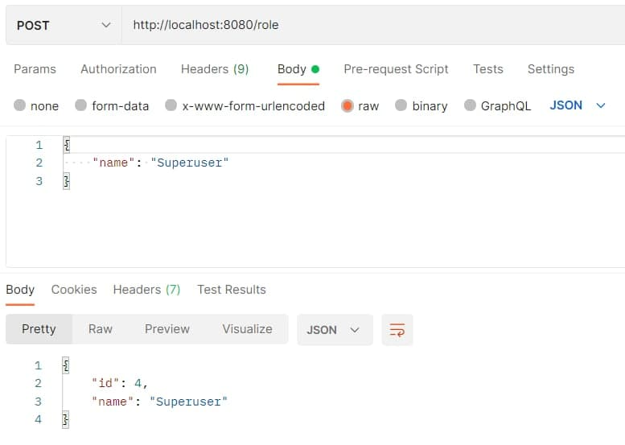
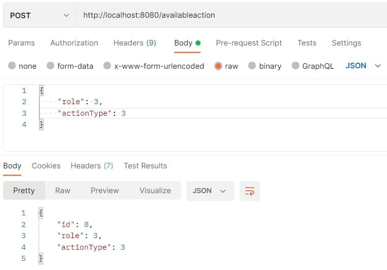

# Тестування працездатності системи

Отримати список всіх ролей:

Отримати роль за її ID:

Створити нову роль:

Оновити дані ролі:

Видалити роль:

Отримати список всіх зв'язків між ролями і типами дій:

Отримати один зв'язкок між роллю і типом дії за його ID:

Створити новий зв'язкок між роллю і типом дії:

Оновити зв'язкок між роллю і типом дії:

Видалити зв'язкок між роллю і типом дії:

